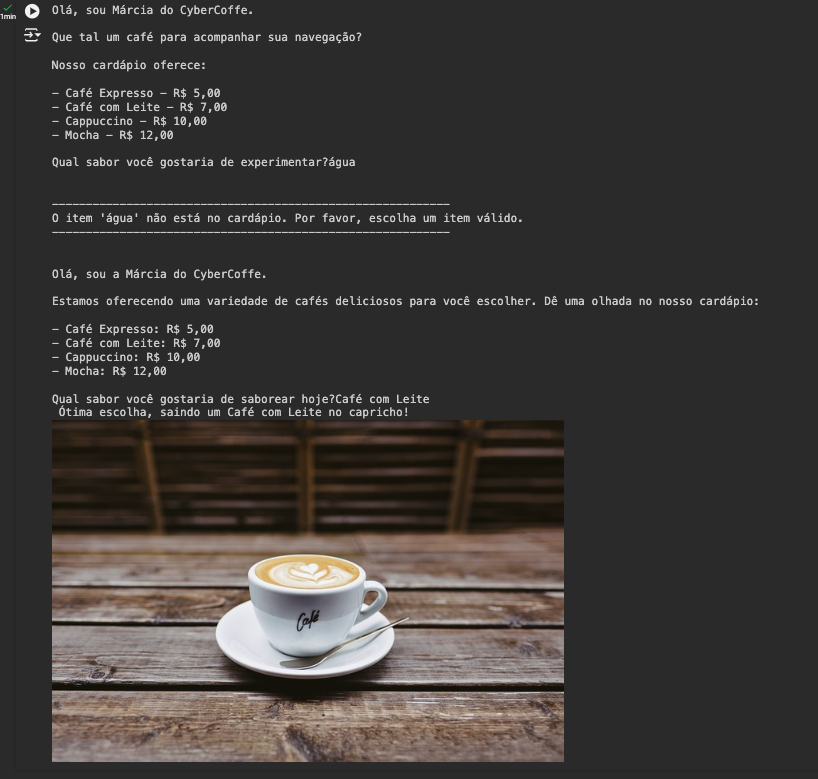

# 🤖 CYBER COFFEE
Imersão IA - Alura 

Imaginei um cenário de cafeteria, onde a atendente Marcia (personagem fictícia) talvez como um totem inteligente e com fluidez em seu auto-atendimento. Implementei uma lógica de atendimento onde ela inicia uma abordagem dinâmica baseada em uma conversa inicial. em seguida ela também mostra o cardápio. Após a escolha do produto, realiza uma validação para comprovar que realmente foi feita uma escolha válida então apresenta o produto.

##  Conceitos e libs utilizadas:

- KEY Google AI Studio;
- Google Colab + python;
- Numpy;
- IPython - Image

## Demonstração

### Aluno - Desenvolvedor

- [@MarcosAntonioFerreira](https://github.com/MarcosAntonioFerreira)
### 🚀 Sobre mim
Eu sou desenvolvedor Front e BackEnd. Trabalho com HTML, CSS, JS, PHP junto com Wordpress. Sou entusiasta por outras Tecnologias como FLutter, Angular e React. Quer me encontrar?

- [@devmarcosalmeida](https://www.linkedin.com/in/dev-marcos-almeida/)

